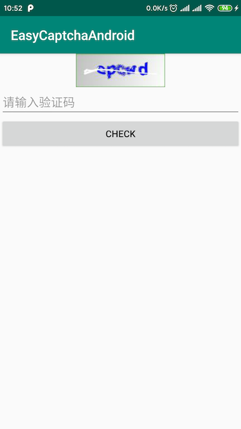

# Easy Captcha Android

---

Restful 风格的验证码，图片使用Base64编码。后端使用Redis存储验证码。

Android 客户端使用Retrofit + OkHttp。


## Retrofit Api

```kotlin
interface ICaptchaApi {

    @POST("/captcha/gen")
    fun gen(@Body req: CaptchaGenReq): Call<BaseResp<CaptchaGenData>>

    @POST("/captcha/check")
    fun check(@Body req: CaptchaCheckReq): Call<BaseResp<Boolean>>
}
```

## Android UI

```kotlin
class MainActivity : AppCompatActivity() {

    var captchaGenData: CaptchaGenData? = null

    override fun onCreate(savedInstanceState: Bundle?) {
        super.onCreate(savedInstanceState)
        setContentView(R.layout.activity_main)

        ivCode.setOnClickListener {
            loadImageCode()
        }
        btnCheck.setOnClickListener {
            check()
        }

        loadImageCode()
    }

    private fun loadImageCode() {
        val req = CaptchaGenReq()
        req.channel = "account_pwd_change"
        req.userId = "12345"

        Apis.captchaApi.gen(req).enqueue(object : Callback<BaseResp<CaptchaGenData>> {

            override fun onResponse(call: Call<BaseResp<CaptchaGenData>>,
                                    response: Response<BaseResp<CaptchaGenData>>) {
                if (response.isSuccessful && response.body() != null) {
                    response.body()?.data?.let {
                        captchaGenData = it

                        val bytes = Base64.decode(it.imageBase64, Base64.DEFAULT)
                        val bitmap = BitmapFactory.decodeByteArray(bytes, 0, bytes.size)
                        ivCode.setImageBitmap(bitmap)
                    }
                }
            }

            override fun onFailure(call: Call<BaseResp<CaptchaGenData>>, t: Throwable) {
            }
        })
    }

    private fun check() {
        val code = edtCode.text.toString()
        if (code.isNotEmpty()) {
            captchaGenData?.let {
                val req = CaptchaCheckReq().apply {
                    captchaId = it.captchaId
                    captchaText = code
                    channel = "account_pwd_change"
                    userId = "12345"
                }

                Apis.captchaApi.check(req).enqueue(object : Callback<BaseResp<Boolean>> {

                    override fun onResponse(call: Call<BaseResp<Boolean>>,
                                            response: Response<BaseResp<Boolean>>) {
                        if (response.isSuccessful) {
                            response.body()?.data?.let {
                                val msg = if (it) "check success " else "check fail"
                                Toast.makeText(this@MainActivity, msg, Toast.LENGTH_LONG).show()
                            }
                        }
                    }

                    override fun onFailure(call: Call<BaseResp<Boolean>>, t: Throwable) {
                    }
                })
            }
        } else {
            Toast.makeText(this, "请输入验证码", Toast.LENGTH_LONG).show()
        }
    }
}
```

## 效果展示



## 后端服务

[后端服务](https://github.com/LiushuiXiaoxia/easy-captcha)

